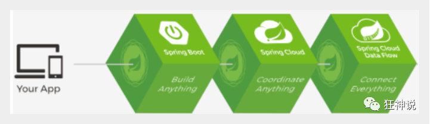

# 1、Spring概述
## 1.1、简介
+ Spring：春天----->给软件行业带来了春天。
+ 2002，首次推出了Spring框架的雏形：interface21框架。
+ Spring框架是以interface21框架为基础，经过重新设计，并不断丰富内涵，于2004年3月24日发布了1.0正式版。
+ **Rod Johnson**,Spring Framework创始人，著名作家。很难想象Rod Johnson的学历，真的让好多人大吃一惊，他是悉尼大学的博士，然而他的专业不是计算机，而是音乐学。
+ Spring理念：使现有的技术更加容易使用，本身就是一个大杂烩，整合了现有的技术框架。

---

+ SSH：Struct2+Spring+Hibernate
+ SSM：SpringMVC+Spring+Mybatis

官网：[https://spring.io/projects/spring-framework#overview](https://spring.io/projects/spring-framework#overview)  
官方下载地址：[https://repo.spring.io/libs-release-local/org/springframework/spring/](https://repo.spring.io/libs-release-local/org/springframework/spring/)  
GitHub : [https://github.com/spring-projects](https://github.com/spring-projects "SpringFramework框架GitHub地址")

```xml
<!-- https://mvnrepository.com/artifact/org.springframework/spring-webmvc -->
<dependency>
    <groupId>org.springframework</groupId>
    <artifactId>spring-webmvc</artifactId>
    <version>5.3.19</version>
</dependency>
<!-- https://mvnrepository.com/artifact/org.springframework/spring-jdbc -->
<dependency>
    <groupId>org.springframework</groupId>
    <artifactId>spring-jdbc</artifactId>
    <version>5.3.19</version>
</dependency>
```

## 1.2、优点
+ Spring是一个开源免费的框架（容器）！
+ Spring是一个轻量级的、非入侵式的框架！
+ 控制反转（IOC）,面向切面编程（AOP）！
+ 支持事务的处理，对框架整合的支持！

**Spring就是一个轻量级的控制反转（IOC）和面向切面编程（AOP）的框架！**

## 1.3、组成
  
Spring 框架是一个分层架构，由 7 个定义良好的模块组成。Spring 模块构建在核心容器之上，核心容器定义了创建、配置和管理 bean 的方式 .  
  
组成 Spring 框架的每个模块（或组件）都可以单独存在，或者与其他一个或多个模块联合实现。每个模块的功能如下：
+ **核心容器**：核心容器提供 Spring 框架的基本功能。核心容器的主要组件是 BeanFactory，它是工厂模式的实现。BeanFactory 使用控制反转（IOC） 模式将应用程序的配置和依赖性规范与实际的应用程序代码分开。
+ **Spring 上下文**：Spring 上下文是一个配置文件，向 Spring 框架提供上下文信息。Spring 上下文包括企业服务，例如 JNDI、EJB、电子邮件、国际化、校验和调度功能。
+ **Spring AOP**：通过配置管理特性，Spring AOP 模块直接将面向切面的编程功能 , 集成到了 Spring 框架中。所以，可以很容易地使 Spring 框架管理任何支持 AOP的对象。Spring AOP 模块为基于 Spring 的应用程序中的对象提供了事务管理服务。通过使用 Spring AOP，不用依赖组件，就可以将声明性事务管理集成到应用程序中。
+ **Spring DAO**：JDBC DAO 抽象层提供了有意义的异常层次结构，可用该结构来管理异常处理和不同数据库供应商抛出的错误消息。异常层次结构简化了错误处理，并且极大地降低了需要编写的异常代码数量（例如打开和关闭连接）。Spring DAO 的面向 JDBC 的异常遵从通用的 DAO 异常层次结构。
+ **Spring ORM**：Spring 框架插入了若干个 ORM 框架，从而提供了 ORM 的对象关系工具，其中包括 JDO、Hibernate 和 iBatis SQL Map。所有这些都遵从 Spring 的通用事务和 DAO 异常层次结构。
+ **Spring Web 模块**：Web 上下文模块建立在应用程序上下文模块之上，为基于 Web 的应用程序提供了上下文。所以，Spring 框架支持与 Jakarta Struts 的集成。Web 模块还简化了处理多部分请求以及将请求参数绑定到域对象的工作。
+ **Spring MVC 框架**：MVC 框架是一个全功能的构建 Web 应用程序的 MVC 实现。通过策略接口，MVC 框架变成为高度可配置的，MVC 容纳了大量视图技术，其中包括 JSP、Velocity、Tiles、iText 和 POI。

## 1.4、拓展
**Spring Boot**与**Spring Cloud**
+ Spring Boot 是 Spring 的一套快速配置脚手架，可以基于Spring Boot 快速开发单个微服务;
+ Spring Cloud是基于Spring Boot实现的；
+ Spring Boot专注于快速、方便集成的单个微服务个体，Spring Cloud关注全局的服务治理框架；
+ Spring Boot使用了约束优于配置的理念，很多集成方案已经帮你选择好了，能不配置就不配置 , Spring Cloud很大的一部分是基于Spring Boot来实现，Spring Boot可以离开Spring Cloud独立使用开发项目，但是Spring Cloud离不开Spring Boot，属于依赖的关系。
+ SpringBoot在SpringClound中起到了承上启下的作用，如果你要学习SpringCloud必须要学习SpringBoot。



---

弊端：发展了太久之后，违背了原本的理念！配置十分繁琐，人称：“配置地狱”！ 

# 2、IOC理论推导
## 2.1、IOC基础
新建一个空白的maven项目
**分析实现**
我们先用我们原来的方式写一段代码
1. 先写一个UserDao接口
```java
public interface UserDao {
   public void getUser();
}
```

2. 再去写Dao的实现类
```java
public class UserDaoImpl implements UserDao {
   @Override
   public void getUser() {
       System.out.println("获取用户数据");
  }
}
```

3. 然后去写UserService的接口
```java
public interface UserService {
   public void getUser();
}
```

4. 最后写Service的实现类
```java
public class UserServiceImpl implements UserService {
   private UserDao userDao = new UserDaoImpl();

   @Override
   public void getUser() {
       userDao.getUser();
  }
}
```

5、测试一下
```java
@Test
public void test(){
   UserService service = new UserServiceImpl();
   service.getUser();
}
```
---

这是我们原来的方式 , 开始大家也都是这么去写的对吧 . 那我们现在修改一下
把Userdao的实现类增加一个
```java
public class UserDaoMySqlImpl implements UserDao {
   @Override
   public void getUser() {
       System.out.println("MySql获取用户数据");
  }
}
```

紧接着我们要去使用MySql的话 , 我们就需要去service实现类里面修改对应的实现
```java
public class UserServiceImpl implements UserService {
   private UserDao userDao = new UserDaoMySqlImpl();

   @Override
   public void getUser() {
       userDao.getUser();
  }
}
```
再假设, 我们再增加一个Userdao的实现类
```java
public class UserDaoOracleImpl implements UserDao {
   @Override
   public void getUser() {
       System.out.println("Oracle获取用户数据");
  }
}
```
那么我们要使用Oracle，又需要去service实现类里面修改对应的实现，假设我们的这种需求非常大，这种方式就根本不适用了，甚至反人类对吧，每次变动，都需要修改大量代码，这种设计的耦合性太高了，牵一发而动全身。

---

**那我们如何去解决呢？**
我们可以在需要用到他的地方，不去实现它，而是留出一个接口，利用set，我们去代码里修改下。
```java
public class UserServiceImpl implements UserService {
   private UserDao userDao;
// 利用set实现
   public void setUserDao(UserDao userDao) {
       this.userDao = userDao;
  }

   @Override
   public void getUser() {
       userDao.getUser();
  }
}
```
现在去我们的测试类里，进行测试；
```java
@Test
public void test(){
   UserServiceImpl service = new UserServiceImpl();
   service.setUserDao( new UserDaoMySqlImpl() );
   service.getUser();
   //那我们现在又想用Oracle去实现呢
   service.setUserDao( new UserDaoOracleImpl() );
   service.getUser();
}
```
这里已经发生了根本性的变化，很多地方都不一样了。以前所有东西都是由程序去进行控制创建，而现在是由我们自行控制创建对象，把主动权交给了调用者。程序不用去管怎么创建、怎么实现了。它只负责提供一个接口。

这种思想，从本质上解决了问题，我们程序员不再去管理对象的创建了，更多的去关注业务的实现。耦合性大大降低。这也就是IOC的原型！


## 2.2、IOC本质
**控制反转IoC(Inversion of Control)，是一种设计思想，DI(依赖注入)是实现IoC的一种方法**，也有人认为DI只是IoC的另一种说法。没有IoC的程序中 , 我们使用面向对象编程 , 对象的创建与对象间的依赖关系完全硬编码在程序中，对象的创建由程序自己控制，控制反转后将对象的创建转移给第三方，个人认为所谓控制反转就是：获得依赖对象的方式反转了。


**IOC是Spring框架的核心内容**，使用多种方式完美的实现了IoC，可以使用XML配置，也可以使用注解，新版本的Spring也可以零配置实现IoC。

Spring容器在初始化时先读取配置文件，根据配置文件或元数据创建与组织对象存入容器中，程序使用时再从Ioc容器中取出需要的对象。


采用XML方式配置Bean的时候，Bean的定义信息是和实现分离的，而采用注解的方式可以把两者合为一体，Bean的定义信息直接以注解的形式定义在实现类中，从而达到了零配置的目的。

**控制反转是一种通过描述（XML或注解）并通过第三方去生产或获取特定对象的方式。在Spring中实现控制反转的是IoC容器，其实现方法是依赖注入（Dependency Injection,DI）。**

# 3、HelloSpring
## 3.1、导入Jar包

注 : spring 需要导入commons-logging进行日志记录 . 我们利用maven , 他会自动下载对应的依赖项 .
```xml
<dependency>
   <groupId>org.springframework</groupId>
   <artifactId>spring-webmvc</artifactId>
   <version>5.1.10.RELEASE</version>
</dependency>
```
## 3.2、编写代码

1、编写一个Hello实体类
```java
public class Hello {
private String name;

public String getName() {
return name;
}
public void setName(String name) {
this.name = name;
}

public void show(){
System.out.println("Hello,"+ name );
}
}
```
2、编写我们的spring文件 , 这里我们命名为beans.xml
```xml
<?xml version="1.0" encoding="UTF-8"?>
<beans xmlns="http://www.springframework.org/schema/beans"
xmlns:xsi="http://www.w3.org/2001/XMLSchema-instance"
xsi:schemaLocation="http://www.springframework.org/schema/beans
http://www.springframework.org/schema/beans/spring-beans.xsd">

   <!--bean就是java对象 , 由Spring创建和管理-->
   <bean id="hello" class="com.kuang.pojo.Hello">
       <property name="name" value="Spring"/>
   </bean>

</beans>
```
3、我们可以去进行测试了 .
```java
@Test
public void test(){
//解析beans.xml文件 , 生成管理相应的Bean对象
ApplicationContext context = new ClassPathXmlApplicationContext("beans.xml");
//getBean : 参数即为spring配置文件中bean的id .
Hello hello = (Hello) context.getBean("hello");
hello.show();
}
```

## 3.3、思考

* Hello 对象是谁创建的?  
**hello 对象是由Spring创建的**

* Hello 对象的属性是怎么设置的？  
**hello 对象的属性是由Spring容器设置的**

这个过程就叫控制反转 :

**控制** : 谁来控制对象的创建 , 传统应用程序的对象是由程序本身控制创建的 , 使用Spring后 , 对象是由Spring来创建的

**反转** : 程序本身不创建对象 , 而变成被动的接收对象 .

**依赖注入** : 就是利用set方法来进行注入的.

IOC是一种编程思想，由主动的编程变成被动的接收

可以通过newClassPathXmlApplicationContext去浏览一下底层源码 .


## 3.4、修改案例一

我们在案例一中， 新增一个Spring配置文件beans.xml
```xml
<?xml version="1.0" encoding="UTF-8"?>
<beans xmlns="http://www.springframework.org/schema/beans"
xmlns:xsi="http://www.w3.org/2001/XMLSchema-instance"
xsi:schemaLocation="http://www.springframework.org/schema/beans
http://www.springframework.org/schema/beans/spring-beans.xsd">

   <bean id="MysqlImpl" class="com.kuang.dao.impl.UserDaoMySqlImpl"/>
   <bean id="OracleImpl" class="com.kuang.dao.impl.UserDaoOracleImpl"/>

   <bean id="ServiceImpl" class="com.kuang.service.impl.UserServiceImpl">
       <!--注意: 这里的name并不是属性 , 而是set方法后面的那部分 , 首字母小写-->
       <!--引用另外一个bean , 不是用value 而是用 ref-->
       <property name="userDao" ref="OracleImpl"/>
   </bean>

</beans>
```
测试！
```java
@Test
public void test2(){
ApplicationContext context = new ClassPathXmlApplicationContext("beans.xml");
UserServiceImpl serviceImpl = (UserServiceImpl) context.getBean("ServiceImpl");
serviceImpl.getUser();
}
```
OK , 到了现在 , 我们彻底不用再程序中去改动了 , 要实现不同的操作 , 只需要在xml配置文件中进行修改 , 所谓的IoC,一句话搞定 : 对象由Spring 来创建 , 管理 , 装配 ! 


# 4、IOC创建对象方式

## 4.1、通过无参构造方法来创建

1、User.java
```java
public class User {

private String name;

public User() {
System.out.println("user无参构造方法");
}

public void setName(String name) {
this.name = name;
}

public void show(){
System.out.println("name="+ name );
}

}
```
2、beans.xml
```xml
<?xml version="1.0" encoding="UTF-8"?>
<beans xmlns="http://www.springframework.org/schema/beans"
xmlns:xsi="http://www.w3.org/2001/XMLSchema-instance"
xsi:schemaLocation="http://www.springframework.org/schema/beans
http://www.springframework.org/schema/beans/spring-beans.xsd">

   <bean id="user" class="com.kuang.pojo.User">
       <property name="name" value="kuangshen"/>
   </bean>

</beans>
```
3、测试类
```java
@Test
public void test(){
ApplicationContext context = new ClassPathXmlApplicationContext("beans.xml");
//在执行getBean的时候, user已经创建好了 , 通过无参构造
User user = (User) context.getBean("user");
//调用对象的方法 .
user.show();
}
```
结果可以发现，在调用show方法之前，User对象已经通过无参构造初始化了！


## 4.2、通过有参构造方法来创建

1、UserT . java
```java
public class UserT {

private String name;

public UserT(String name) {
this.name = name;
}

public void setName(String name) {
this.name = name;
}

public void show(){
System.out.println("name="+ name );
}

}
```
2、beans.xml 有三种方式编写
```xml
<!-- 第一种根据index参数下标设置 -->
<bean id="userT" class="com.kuang.pojo.UserT">
   <!-- index指构造方法 , 下标从0开始 -->
   <constructor-arg index="0" value="kuangshen2"/>
</bean>
<!-- 第二种根据参数名字设置 -->
<bean id="userT" class="com.kuang.pojo.UserT">
   <!-- name指参数名 -->
   <constructor-arg name="name" value="kuangshen2"/>
</bean>
<!-- 第三种根据参数类型设置 -->
<bean id="userT" class="com.kuang.pojo.UserT">
   <constructor-arg type="java.lang.String" value="kuangshen2"/>
</bean>
```
3、测试
```java
@Test
public void testT(){
ApplicationContext context = new ClassPathXmlApplicationContext("beans.xml");
UserT user = (UserT) context.getBean("userT");
user.show();
}
```
结论：在配置文件加载的时候。其中管理的对象都已经初始化了！

# 5、Spring配置
## 5.1、别名

alias 设置别名 , 为bean设置别名 , 可以设置多个别名
```xml
<!--设置别名：在获取Bean的时候可以使用别名获取-->
<alias name="userT" alias="userNew"/>
```

## 5.2、Bean的配置
```xml
<!--bean就是java对象,由Spring创建和管理-->

<!--
   id 是bean的标识符,要唯一,如果没有配置id,name就是默认标识符
   如果配置id,又配置了name,那么name是别名
   name可以设置多个别名,可以用逗号,分号,空格隔开
   如果不配置id和name,可以根据applicationContext.getBean(.class)获取对象;

class是bean的全限定名=包名+类名
-->
<bean id="hello" name="hello2 h2,h3;h4" class="com.kuang.pojo.Hello">
   <property name="name" value="Spring"/>
</bean>
```

## 5.3、import
团队的合作通过import来实现
假设，现在项目中有多个人开发，这三个人复制不同的类开发，不同的类需要注册在不同的bean中，我们可以利用import将所有人的beans.xml合并为一个总的！
* 张三
* 李四
* 王五
* applicationContext.xml

```xml
<import resource="{path}/beans.xml"/>
<import resource="{path}/beans2.xml"/>
<import resource="{path}/beans3.xml"/>
```

使用的时候，直接使用总的配置就可以了


# 6、依赖注入

## 6.1、构造器注入
前面已经说过了


## 6.2、set方式注入【重点】
* 依赖注入：set注入！  
  * 依赖：bean对象的创建依赖于容器！
  * 注入：bean对象中的所有属性，由容器来注入！
  
【环境搭建】
1. 复杂类型
```java
public class Address {
    private String address;

    public String getAddress() {
        return address;
    }

    public void setAddress(String address) {
        this.address = address;
    }
}
```
2. 真事测试对象
```java
public class Student {
    private String name;
    private Address address;
    private String[] book;
    private List<String> hobbies;
    private Map<String,String> card;
    private Set<String> games;
    private String wife;
    private Properties info;
}
```
3. beans.xml
```xml
<?xml version="1.0" encoding="UTF-8"?>
<beans xmlns="http://www.springframework.org/schema/beans"
       xmlns:xsi="http://www.w3.org/2001/XMLSchema-instance"
       xsi:schemaLocation="http://www.springframework.org/schema/beans
        https://www.springframework.org/schema/beans/spring-beans.xsd">

    <bean id="student" class="com.wugang.pojo.Student">
        <!-- 第一种：普通值注入，value -->
        <property name="name" value="张三"/>
    </bean>
</beans>
```
4. 测试类
```java
public class MyTest {
    public static void main(String[] args) {
        ApplicationContext context = new ClassPathXmlApplicationContext("beans.xml");
        Student student = (Student) context.getBean("student");

        System.out.println(student.getName());
    }
}
```

完善注入信息
```xml
<?xml version="1.0" encoding="UTF-8"?>
<beans xmlns="http://www.springframework.org/schema/beans"
       xmlns:xsi="http://www.w3.org/2001/XMLSchema-instance"
       xsi:schemaLocation="http://www.springframework.org/schema/beans
        https://www.springframework.org/schema/beans/spring-beans.xsd">

    <bean id="address" class="com.wugang.pojo.Address">
        <property name="address" value="林荫大道108号"/>
    </bean>

    <bean id="student" class="com.wugang.pojo.Student">
        <!-- 普通值注入，value -->
        <property name="name" value="张三"/>

        <!-- bean注入，ref -->
        <property name="address" ref="address"/>

        <!-- 数组注入，ref -->
        <property name="book">
            <array>
                <value>三国演义</value>
                <value>水浒传</value>
                <value>西游记</value>
                <value>红楼梦</value>
            </array>
        </property>

        <!-- List注入 -->
        <property name="hobbies">
            <list>
                <value>听歌</value>
                <value>看电影</value>
                <value>打篮球</value>
            </list>
        </property>

        <!-- Map -->
        <property name="card">
            <map>
                <entry key="身份证" value="123456789456321598"/>
                <entry key="银行卡" value="12345678945652159875"/>
            </map>
        </property>

        <!-- Set -->
        <property name="games">
            <set>
                <value>LOL</value>
                <value>DNF</value>
            </set>
        </property>

        <!-- Null -->
        <property name="wife">
            <null/>
        </property>

        <!-- Properties -->
        <property name="info">
            <props>
                <prop key="driver">201612085</prop>
                <prop key="url">男</prop>
                <prop key="username">男</prop>
                <prop key="password">男</prop>
            </props>
        </property>
    </bean>
</beans>
```

## 6.3、拓展方式注入

我们可以使用p命名空间和c命名空间进行注入  
官方解释：


使用：
```xml
<?xml version="1.0" encoding="UTF-8"?>
<beans xmlns="http://www.springframework.org/schema/beans"
       xmlns:xsi="http://www.w3.org/2001/XMLSchema-instance"
       xmlns:p="http://www.springframework.org/schema/p"
       xmlns:c="http://www.springframework.org/schema/c"
       xsi:schemaLocation="http://www.springframework.org/schema/beans
        https://www.springframework.org/schema/beans/spring-beans.xsd">

    <!-- p命名空间注入，可以直接注入属性的值：property -->
    <bean id="user" class="com.wugang.pojo.User" p:name="李四" p:age="18"/>

    <!-- c命名空间注入，通过构造器注入：construct-orgs -->
    <bean id="user2" class="com.wugang.pojo.User" c:name="王五" c:age="108"/>
</beans>
```

测试：
```java
@Test
public void test2() {
   ApplicationContext context = new ClassPathXmlApplicationContext("userBeans.xml");
   User user = context.getBean("user2", User.class);

   System.out.println(user);
}
```

注意点：p命名和c命名空间不能直接使用，需要导入xml约束！
```xml
xmlns:p="http://www.springframework.org/schema/p"
xmlns:c="http://www.springframework.org/schema/c"
```

## 6.4、bean的作用域


1. 单例模式（Spring默认机制）
   
   ```xml
   <bean id="user2" class="com.wugang.pojo.User" c:name="王五" c:age="108" scope="singleton"/>
   ```
2. 原型模式：每次从容器中get的时候，都会产生一个新对象！
   
   ```xml
   <bean id="user2" class="com.wugang.pojo.User" c:name="王五" c:age="108" scope="prototype"/>
   ```
3. 其余的request、session、application，这些只能在web开发中使用到！

# 7、Bean的自动装配

* 自动装配是Spring满足bean依赖的一种方式！
* Spring会在上下文中自动寻找，并自动给bean装配属性！


在Spring中有三种装配的方式
1. 在xml中显示的配置
2. 在java中显示配置
3. 隐式的自动装配bean 【重要】

## 7.1、测试
环境搭建：一个人有两个宠物！
```java
public class People {
    private Cat cat;
    private Dog dog;
    private String name;
}

public class Cat {
    public void shout(){
        System.out.println("miao");
    }
}

public class Dog {
    public void shout(){
        System.out.println("wang");
    }
}
```

```xml
<bean id="cat" class="com.wugang.pojo.Cat"/>
<bean id="dog" class="com.wugang.pojo.Dog"/>

<bean id="people" class="com.wugang.pojo.People">
   <property name="name" value="周吴郑王"/>
   <property name="cat" ref="cat"/>
   <property name="dog" ref="dog"/>
</bean>
```

```java
@Test
public void test1() {
   ApplicationContext context = new ClassPathXmlApplicationContext("beans.xml");
   People people = context.getBean("people", People.class);

   people.getCat().shout();
   people.getDog().shout();
}
```

## 7.2、byName自动装配
```xml
<!--
byName：会自动在容器上下文查找和自己对象set方法后面的值对应的beanid！
-->
<bean id="people" class="com.wugang.pojo.People" autowire="byName">
   <property name="name" value="周吴郑王"/>
</bean>
```

## 7.3、byType自动装配
```xml
<bean class="com.wugang.pojo.Cat"/>
<bean class="com.wugang.pojo.Dog"/>

<!--
byName：会自动在容器上下文查找和自己对象set方法后面的值对应的beanid！id和set方法后面的值名称必须相同，否则找不到
byType：会自动在容器上下文查找和自己对象属性类型相同的bean！此时被装配对象bean的id可以省略
-->
<bean id="people" class="com.wugang.pojo.People" autowire="byType">
   <property name="name" value="周吴郑王"/>
</bean>
```

小结：
* byName的时候，需要保证所有bean的id唯一，并且这个bean需要和自动注入的属性的set方法的值一致！
* byType的时候，需要保证所有bean的class唯一，并且这个bean需要和自动注入的属性的属性的类型一致！

## 7.4、 使用注解实现自动装配

jdk1.5支持的注解，Spring2.5就支持注解了。  
The introduction of annotation-based configuration raised the question of whether this approach is “better” than XML.

要使用注解须知：
1. 导入约束，context约束
2. **配置注解的支持：<context:annotation-config/>【重要】**
   ```xml
   <?xml version="1.0" encoding="UTF-8"?>
   <beans xmlns="http://www.springframework.org/schema/beans"
    xmlns:xsi="http://www.w3.org/2001/XMLSchema-instance"
    xmlns:context="http://www.springframework.org/schema/context"
    xsi:schemaLocation="http://www.springframework.org/schema/beans
        https://www.springframework.org/schema/beans/spring-beans.xsd
        http://www.springframework.org/schema/context
        https://www.springframework.org/schema/context/spring-context.xsd">

    <context:annotation-config/>

   </beans>
   ```

@Autowired
直接在属性上使用即可！也可以在set方式上使用！  
使用Autowired时我们可以不用编写set方法，前提是你这个自动装配的属性在IOC（Spring）容器中存在，且符合名字byName！  
科普：
```java
@Nullable   若某个字段使用了这个注解，说明这个字段可以为null；
```

```java
public @interface Autowired {
    boolean required() default true;
}
```

测试代码：
```java
public class People {
    //如果显示定义了Autowired的required属性为false，说明这个对象可以为null，否则不允许为空
    @Autowired(required = false)
    private Cat cat;
    @Autowired
    private Dog dog;
    private String name;
}
```

如果@Autowired自动装配的环境比较复杂，自动装配无法通过一个注解[@Autowired]完成的时候，我们可以使用@Qualifier(value = "xxx")去配合@Autowired的使用，指定一个唯一的bean对象注入！
```xml
<bean id="cat" class="com.wugang.pojo.Cat"/>
<bean id="cat111" class="com.wugang.pojo.Cat"/>
<bean id="dog" class="com.wugang.pojo.Dog"/>
<bean id="dog222" class="com.wugang.pojo.Dog"/>
<bean id="people" class="com.wugang.pojo.People"/>
```
```java
public class People {
    @Autowired
    @Qualifier(value = "cat222")
    private Cat cat;
    @Autowired
    @Qualifier(value = "dog222")
    private Dog dog;
    private String name;
}
```

**@Resource注解**
```java
public class People {
    @Resource(name = "cat1")
    private Cat cat;
    @Resource(name = "dog2")
    private Dog dog;
    private String name;
}
```


小结：
@Resource和@Autowired的区别：
* 都是用来自动装配的，都可雨放在属性字段上
* @Autowired 默认通过byType的方式实现，如果找不到，则通过byName实现，而且必须要求这个对象存在！【常用】
* @Resource 默认通过byName的方式实现，如果找不到名字，则通过byType实现！如果两个都找不到的情况下，就会报错！【常用】
* 执行顺序不同：@Autowired 通过byType的方式实现；@Resource 默认通过byName的方式实现

# 8、使用注解开发
在Spring4之后，要使用注解开发，必须要保证aop的包导入了

使用注解需要导入context约束，增加注解的支持!
```xml
<?xml version="1.0" encoding="UTF-8"?>
<beans xmlns="http://www.springframework.org/schema/beans"
       xmlns:xsi="http://www.w3.org/2001/XMLSchema-instance"
       xmlns:context="http://www.springframework.org/schema/context"
       xsi:schemaLocation="http://www.springframework.org/schema/beans
     https://www.springframework.org/schema/beans/spring-beans.xsd
     http://www.springframework.org/schema/context
     https://www.springframework.org/schema/context/spring-context.xsd">

    <context:annotation-config/>

</beans>
```
1. bean  
@Component：组件，放在类上，说明这个类被Spring管理了，就是bean！
```java
//等价于 <bean id="user" class="com.wugang.pojo.User"/>
//@Component 组件
@Component
public class User {
    public String name;
}
```

2. 属性如何注入
```java
@Component
public class User {
    
    public String name;
    
    //相当于 <property name="name" value="张三123456789"/>
    @Value("张三123456789")
    public void setName(String name) {
        this.name = name;
    }
}
```

3. 衍生的注解  
@Component 有几个衍生注解，我们在web开发中，会按照mvc三层架构分层！
   * dao 【@Repository】
   * service 【@Service】
   * controller 【@Controller】  

这四个注解功能都是一样的，都是代表将某个类注册到Spring中，装配Bean

4. 自动装配
   

5. 作用域  
@Scope("singleton")
```java
@Component
@Scope("singleton")
public class User {

    public String name;
}
```

6. 小结  
**xml与注解：** 
   * xml更加万能，适用于任何场景！维护简单方便
   * 注解 不是自己类使用不了，维护相对复杂！
  
   **xml与注解最佳实践：**
   * xml用来管理bean；
   * 注解只负责完成属性的注入；
   * 我们在使用的过程中，只需要注意一个问题：必须让注解生效，就需要开启注解的支持
      ```xml
      <!-- 指定要扫描的包，这个包下的注解就会生效 -->
      <context:component-scan base-package="com.wugang"/>
      <context:annotation-config/>
      ```
# 9、使用Java的方法配置Spring
我们现在要完全不使用Spring的xml配置了，全权交给java来做！  
JavaConfig是Spring的一个子项目，在Spring 4 之后，它成为了一个核心功能！


user类：
```java
//这个注解的意思：就是说明这个类被Spring接管了，注册到了容器中
@Component
public class User {
    private String name;

    public String getName() {
        return name;
    }

    @Value("张三AppConfig") //属性注入值
    public void setName(String name) {
        this.name = name;
    }

    @Override
    public String toString() {
        return "User{" +
                "name='" + name + '\'' +
                '}';
    }
}
```
config类（配置类）：
```java
package com.wugang.config;

import com.wugang.pojo.User;
import org.springframework.context.annotation.Bean;
import org.springframework.context.annotation.ComponentScan;
import org.springframework.context.annotation.Configuration;
import org.springframework.context.annotation.Import;

 */
//这个也会被Spring容器托管，注册到容器中，因为它本身就是一个@Component
//@Configuration代表这是一个配置类，就和我们之前看的Beans.xml一样
@Configuration
@ComponentScan("com.wugang.pojo")
@Import(Config2.class)
public class Config {

    //注册一个bean，就相当于我们之前写的一个bean标签，
    //这个方法的名字就是相当于bean标签中的id属性
    //这个方法的返回值就相当于bean标签中的class属性
    @Bean
    public User getUser(){
        return new User();  //就是返回要注入到bean的对象！
    }
}
```

测试类：
```java
public class Test {
    public static void main(String[] args) {
        //如果完全使用了配置类方式去做，我们就只能通过 AnnotationConfig 上下文来获取容器，通过配置类的class对象加载！
        ApplicationContext context = new AnnotationConfigApplicationContext(Config.class);

        User user = (User) context.getBean("getUser");

        System.out.println(user.getName());
    }
}
```


这种纯Java的配置方式，在SpringBoot中随处可见！

---

# 10、代理模式
为什么要学习代理模式？  
因为这就是Spring AOP的底层！【Spring AOP 和 SpringMVC】  


代理模式的分类：
* 静态代理
* 动态代理

代理模式：  


## 10.1、静态代理
角色分析：
* 抽象角色：一般会使用接口或者抽象类来解决
* 真实角色：被代理的角色
* 代理角色：代理真实角色，代理真实角色后，我们一般会做一些附属操作
* 客户：访问代理对象对的人

代码步骤：
1. 接口
   ```java
    //租房
    public interface Rent {
        void rent();
    }
   ```
   
2. 真实角色
   ```java
    /**
    * 房东
    */
    public class Host implements Rent{

        @Override
        public void rent() {
            System.out.println("房东要出租房子！");
        }
    }
   ```
   
3. 代理角色
   ```java
    /**
    * 中介
    */
    public class Proxy implements Rent {
        private Host host;

        public Proxy() {
        }

        public Proxy(Host host) {
            this.host = host;
        }

        @Override
        public void rent() {
            seeHouse();
            host.rent();
            hetong();
            fare();
        }

        /**
        * 看房
        */
        public void seeHouse() {
            System.out.println("中介带你看房！");
        }

        /**
        * 签租赁合同
        */
        public void hetong() {
            System.out.println("签租赁合同！");
        }

        /**
        * 收中介费
        */
        public void fare() {
            System.out.println("收中介费！");
        }
    }
   ```
   
4. 客户端访问代理juese
   ```java
   public class Client {
        public static void main(String[] args) {
            //房东要租房子
            Host host = new Host();
            //代理，中介帮房东租房子，但是呢？代理角色一般会有一些附属操作！
            Proxy proxy = new Proxy(host);
            //你不用面对房东，直接找中介租房即可！
            proxy.rent();
        }
    }
   ```

代理模式的好处：
* 可以使真实角色的操作更加纯粹！不用去关注一些公共的业务
* 公共业务就交给代理角色！实现了业务的分工！
* 公共业务发生扩展的时候，方便集中管理！

缺点：
* 一个真实角色就会产生一个代理角色：代码量会翻倍~代码效率会变低


## 10.2、加深理解
代码：
1. service接口：
   ```java
    public interface UserService {
        void add();
        void delete();
        void update();
        void query();
    }
   ```

2. service实现类：
   ```java
    /**
    * 真实对象
    */
    public class UserServiceImpl implements UserService{
        @Override
        public void add() {
            System.out.println("增加了一个用户");
        }

        @Override
        public void delete() {
            System.out.println("删除了一个用户");
        }

        @Override
        public void update() {
            System.out.println("修改了一个用户");
        }

        @Override
        public void query() {
            System.out.println("查询了一个用户");
        }

        //1.改动原有的业务代码，在公司中是大忌！
    }
   ```

3. servic实现类代理：
   ```java
    /**
    * 代理service实现类，增加一个log输出的方法
    */
    public class UserServiceProxy implements UserService{
        private UserServiceImpl userService;

        public void setUserService(UserServiceImpl userService) {
            this.userService = userService;
        }

        @Override
        public void add() {
            log("add");
            userService.add();
        }

        @Override
        public void delete() {
            log("delete");
            userService.delete();
        }

        @Override
        public void update() {
            log("update");
            userService.update();
        }

        @Override
        public void query() {
            log("query");
            userService.query();
        }

        /**
        * 日志方法
        * @param msg
        */
        public void log(String msg){
            System.out.println("[Debug] 使用了" + msg + "方法");
        }
    }
   ```
   
4. 客户端访问service：
   ```java
    public class Client {
        public static void main(String[] args) {
            UserServiceImpl userService = new UserServiceImpl();

            UserServiceProxy userServiceProxy = new UserServiceProxy();

            userServiceProxy.setUserService(userService);

            userServiceProxy.add();
        }
    }
   ```
重点理解其中的**思想**；  
**我们在不改变原来的代码的情况下，实现了对原有功能的增强，这是AOP中最核心的思想**

聊聊AOP：纵向开发，横向开发


## 10.3、动态代理
* 动态代理和静态代理角色一样
* 动态代理的代理类是动态生成的，不是我们直接写好的！
* 动态代理分为两大类：基于接口的动态代理，基于类的动态代理
  * 基于接口的动态代理----JDK动态代理
  * 基于类的动态代理--cglib
  * 现在用的比较多的是 javasist 来生成动态代理

我们这里使用JDK的原生代码来实现，其余的道理都是一样的！


**JDK的动态代理需要了解两个类**：  
InvocationHandler：调用处理程序 和 Proxy：代理

【InvocationHandler：调用处理程序】  

```java
Object invoke(Object proxy, 方法 method, Object[] args)；
//参数
//proxy - 调用该方法的代理实例
//method -所述方法对应于调用代理实例上的接口方法的实例。方法对象的声明类将是该方法声明的接口，它可以是代理类继承该方法的代理接口的超级接口。
//args -包含的方法调用传递代理实例的参数值的对象的阵列，或null如果接口方法没有参数。原始类型的参数包含在适当的原始包装器类的实例中，例如java.lang.Integer或java.lang.Boolean 。
```

【Proxy  : 代理】 


```java
//生成代理类
public Object getProxy(){
   return Proxy.newProxyInstance(this.getClass().getClassLoader(),
                                 rent.getClass().getInterfaces(),this);
}
```

**代码实现**
抽象角色和真实角色和之前的一样！
Rent . java 即抽象角色
```java
//抽象角色：租房
public interface Rent {
   public void rent();
}
```

```java
Host . java 即真实角色

//真实角色: 房东，房东要出租房子
public class Host implements Rent{
   public void rent() {
       System.out.println("房屋出租");
  }
}
```

ProxyInvocationHandler. java 即代理角色
```java
public class ProxyInvocationHandler implements InvocationHandler {
   private Rent rent;

   public void setRent(Rent rent) {
       this.rent = rent;
  }

   //生成代理类，重点是第二个参数，获取要代理的抽象角色！之前都是一个角色，现在可以代理一类角色
   public Object getProxy(){
       return Proxy.newProxyInstance(this.getClass().getClassLoader(),
               rent.getClass().getInterfaces(),this);
  }

   // proxy : 代理类 method : 代理类的调用处理程序的方法对象.
   // 处理代理实例上的方法调用并返回结果
   @Override
   public Object invoke(Object proxy, Method method, Object[] args) throws Throwable {
       seeHouse();
       //核心：本质利用反射实现！
       Object result = method.invoke(rent, args);
       fare();
       return result;
  }

   //看房
   public void seeHouse(){
       System.out.println("带房客看房");
  }
   //收中介费
   public void fare(){
       System.out.println("收中介费");
  }

}
```

Client . java
```java
//租客
public class Client {

   public static void main(String[] args) {
       //真实角色
       Host host = new Host();
       //代理实例的调用处理程序
       ProxyInvocationHandler pih = new ProxyInvocationHandler();
       pih.setRent(host); //将真实角色放置进去！
       Rent proxy = (Rent)pih.getProxy(); //动态生成对应的代理类！
       proxy.rent();
  }

}
```
核心：**一个动态代理 , 一般代理某一类业务 , 一个动态代理可以代理多个类，代理的是接口！**


**深化理解**
我们来使用动态代理实现代理我们后面写的UserService！  
我们也可以编写一个通用的动态代理实现的类！所有的代理对象设置为Object即可！  
```java
public class ProxyInvocationHandler implements InvocationHandler {
   private Object target;

   public void setTarget(Object target) {
       this.target = target;
  }

   //生成代理类
   public Object getProxy(){
       return Proxy.newProxyInstance(this.getClass().getClassLoader(),
               target.getClass().getInterfaces(),this);
  }

   // proxy : 代理类
   // method : 代理类的调用处理程序的方法对象.
   public Object invoke(Object proxy, Method method, Object[] args) throws Throwable {
       log(method.getName());
       Object result = method.invoke(target, args);
       return result;
  }

   public void log(String methodName){
       System.out.println("执行了"+methodName+"方法");
  }

}
```

测试！
```java
public class Test {
   public static void main(String[] args) {
       //真实对象
       UserServiceImpl userService = new UserServiceImpl();
       //代理对象的调用处理程序
       ProxyInvocationHandler pih = new ProxyInvocationHandler();
       pih.setTarget(userService); //设置要代理的对象
       UserService proxy = (UserService)pih.getProxy(); //动态生成代理类！
       proxy.delete();
  }
}
```
测试，增删改查，查看结果！

**动态代理的好处：**  
静态代理有的它都有，静态代理没有的，它也有！
* 可以使真实角色的操作更加纯粹！不用去关注一些公共的业务
* 公共业务就交给代理角色！实现了业务的分工！
* 公共业务发生扩展的时候，方便集中管理！
* 一个动态代理类代理的是一个接口，一般对应的就是一类业务
* 一个动态代理类可以代理多个类，只要是实现了同一个接口即可


# 11、AOP

## 11.1、什么是AOP
AOP（Aspect Oriented Programming）意味：面向切面编程，通过预编译方式和运行期动态代理实现程序功能的统一维护的一种技术。AOP是OOP（面向对象）的延续，是软件开发中的一个热点，也是Spring框架中的一个重要内容，是函数式编程的一种衍生范型。利用AOP可以对业务逻辑的各个部分进行隔离，从而使业务逻辑各部分之间的耦合度降低，提高程序的可重用性，同时提高了开发的效率。  


## 11.2、AOP在Spring中的作用
**提供声明式事务；允许用户自定义切面**  
一下名词需要了解下：
* 横切关注点：跨越应用程序多个模块的方法或功能。就是，与我们业务逻辑无关的，但是我们需要关注的部分，就是横切关注点。例如日志、安全、缓存、事务等等...
* 切面（Aspect）：横切关注点被模块化的特殊对象。即，它是一个类。
* 通知（Adivice）：切面必须要完成的工作。即，它是类中的一个方法。
* 目标（Target）：被通知对象。
* 代理（Proxy）：向目标对象应用通知之后创建的对象。
* 切入点（PointCut）：切面通知执行的“地点”的定义。
* 连接点（JointPoint）：与切入点匹配的执行点。


SpringAOP中，通过Advice定义横切逻辑，Spring中支持5中类型的Advice：  


即AOP在不改变原有代码的情况下，去增加新的功能。

## 11.3、使用Spring实现AOP
【重点】使用AOP织入，需要导入一个依赖包！
```xml
<dependency>
    <groupId>org.aspectj</groupId>
    <artifactId>aspectjweaver</artifactId>
    <version>1.9.4</version>
</dependency>
```

方式一：使用Spring的Api接口 【主要是SpringAPI接口实现】

方式二：自定义来实现AOP 【主要是切面定义】

方式三：使用注解实现


# 12、整合Mybatis
步骤：
1. 导入相关jar包
   * junit
    ```xml
    <dependency>
        <groupId>junit</groupId>
        <artifactId>junit</artifactId>
        <version>4.13.2</version>
    </dependency>
    ```
   * mybatis
    ```xml
    <dependency>
        <groupId>org.mybatis</groupId>
        <artifactId>mybatis</artifactId>
        <version>3.5.9</version>
    </dependency>
    ```
   * mysql数据库
    ```xml
    <dependency>
        <groupId>mysql</groupId>
        <artifactId>mysql-connector-java</artifactId>
        <version>8.0.28</version>
    </dependency>
    ```
   * spring相关的
    ```xml
    <dependency>
        <groupId>org.springframework</groupId>
        <artifactId>spring-webmvc</artifactId>
        <version>5.3.19</version>
    </dependency>
    <!-- Spring操作数据库的话，需要一个spring-jdbc -->
    <dependency>
        <groupId>org.springframework</groupId>
        <artifactId>spring-jdbc</artifactId>
        <version>5.3.19</version>
    </dependency>
    ```
   * aop织入
    ```xml
    <dependency>
        <groupId>org.aspectj</groupId>
        <artifactId>aspectjweaver</artifactId>
        <version>1.9.9.1</version>
    </dependency>
    ```
   * mybatis-spring 【new】
    ```xml
    <dependency>
        <groupId>org.mybatis</groupId>
        <artifactId>mybatis-spring</artifactId>
        <version>2.0.7</version>
    </dependency>
    ```
2. 编写配置文件
3. 测试

**注意：Maven静态资源过滤问题**
```xml
<build>
   <resources>
       <resource>
           <directory>src/main/java</directory>
           <includes>
               <include>**/*.properties</include>
               <include>**/*.xml</include>
           </includes>
           <filtering>true</filtering>
       </resource>
   </resources>
</build>
```

## 12.1、回忆Mybatis
1. 编写实体类
```java
public class User {
    private int id;
    private String name;
    private String pwd;
}
```
2. 编写核心配置文件
```xml
<?xml version="1.0" encoding="UTF-8" ?>
<!DOCTYPE configuration
       PUBLIC "-//mybatis.org//DTD Config 3.0//EN"
       "http://mybatis.org/dtd/mybatis-3-config.dtd">
<configuration>

   <typeAliases>
       <package name="com.kuang.pojo"/>
   </typeAliases>

   <environments default="development">
       <environment id="development">
           <transactionManager type="JDBC"/>
           <dataSource type="POOLED">
               <property name="driver" value="com.mysql.jdbc.Driver"/>
               <property name="url" value="jdbc:mysql://localhost:3306/mybatis?useSSL=true&amp;useUnicode=true&amp;characterEncoding=utf8"/>
               <property name="username" value="root"/>
               <property name="password" value="123456"/>
           </dataSource>
       </environment>
   </environments>

   <mappers>
       <package name="com.kuang.dao"/>
   </mappers>
</configuration>
```
3. 编写接口
```java
public interface UserMapper {
   public List<User> selectUser();
}
```
4. 编写Mapper.xml
```xml
<?xml version="1.0" encoding="UTF-8" ?>
<!DOCTYPE mapper
       PUBLIC "-//mybatis.org//DTD Mapper 3.0//EN"
       "http://mybatis.org/dtd/mybatis-3-mapper.dtd">
<mapper namespace="com.kuang.dao.UserMapper">

   <select id="selectUser" resultType="User">
    select * from user
   </select>

</mapper>
```
5. 测试
```java
@Test
public void selectUser() throws IOException {

   String resource = "mybatis-config.xml";
   InputStream inputStream = Resources.getResourceAsStream(resource);
   SqlSessionFactory sqlSessionFactory = new SqlSessionFactoryBuilder().build(inputStream);
   SqlSession sqlSession = sqlSessionFactory.openSession();

   UserMapper mapper = sqlSession.getMapper(UserMapper.class);

   List<User> userList = mapper.selectUser();
   for (User user: userList){
       System.out.println(user);
  }

   sqlSession.close();
}
```


## 12.2、Mybatis-Spring
引入Spring之前需要了解mybatis-spring包中的一些重要类；  
mybatis-spring网站：[http://www.mybatis.org/spring/zh/index.html](http://www.mybatis.org/spring/zh/index.html)  
  

### 12.2.1、什么是Mybatis-Spring？
Mybatis-Spring会帮助你将Mybatis代码无缝地整合到Spring中。

### 12.2.2、知识基础
在开始使用Mybatis-Spring之前，我们需要先熟悉Spring和Mybatis这两个框架和有关他们的术语。这很重要  
Mybatis-Spring 需要一下版本：  

MyBatis-Spring|MyBatis|Spring 框架|Spring Batch|Java
:-:|:-:|:-:|:-:|:-:
2.0|3.5+|5.0+|4.0+|Java 8+
1.3|3.4+|3.2.2+|2.1+|Java 6+

如果使用Maven作为构建工具，仅需要在pom.xml中加入以下代码即可：
```xml
<dependency>
   <groupId>org.mybatis</groupId>
   <artifactId>mybatis-spring</artifactId>
   <version>2.0.7</version>
</dependency>
```
要和Spring一起使用Mybatis，需要在Spring应用上下文中定义至少两样东西：一个是SqlSessionFactory和至少一个数据映射器类。

在Mybatis-Spring中，可使用SqlSessionFactoryBean来创建SqlSessionFactory。要配置这个工厂bean，需要吧下面的配置放在Spring的xml配置文件中：
```xml
<bean id="sqlSessionFactory" class="org.mybatis.spring.SqlSessionFactoryBean">
 <property name="dataSource" ref="dataSource" />
</bean>
```
注意：SqlSessionFactory需要一个DataSource（数据源）。这可以是任意的DataSource，只需要和配置其他Spring数据库链接一样配置它就可以了。

在基础的Mybatis用法中，是通过SqlSessionFactoryBuilder来创建SqlSessionFactory的。而在Mybatis-Spring中，则使用SqlSessionFactoryBean来创建。

在Mybatis中，你可以使用SqlSessionFactory来创建sqlSession。一旦你获得一个SqlSession之后，你可以使用它来执行映射了的语句，提交或者回滚连接，最后，当不再需要它的时候，你可以关闭SqlSession。

SqlSessionFactory有一个唯一的必要属性：用于JDBC的DataSource。这可以是任意的DatatSource对象，它的配置方法和其他Spring数据库链接是一样的。

一个常用的属性是configLocation，它用来指定Mybatis的xml配置文件路径。它在需要修改Mybatis的基础配置时非常有用。通常，基础配置指的是<<settings>settings>或<<typeAliases>typeAliases>  
需要注意的是，这个配置文件并不需要是一个完整的Mybatis配置。确切的说，任何环境配置（<<environments>environments），数据源（<<DataSource>DataSource>）和Mybatis的事务管理器（<<transactionManager>transactionMannager>）都会被忽略。SqlSessionFactoryBean会创建它自有的Mybatis环境配置（<<Environment>Environment>），并按要求设置自定义环境的值。

SqlSessionTemplate是Mybatis-Spring的核心。作为SqlSession的一个实现，这意味着可以使用它无缝代替你代码中已经在使用的SqlSession。  
SqlSessionTemplate可以参与到Spring的事务管理中，并且由于其是线程安全的，可以供多个映射器类使用，我们应该总是用SqlSessionTemplate来替换Mybatis默认的DefaultSqlSession实现。  
可以使用SqlSessionFactory作为构造方法的参数来创建SqlSessionTemplate对象。
```xml
<bean id="sqlSession" class="org.mybatis.spring.SqlSessionTemplate">
    <constructor-arg index="0" ref="sqlSessionFactory" />
</bean>
```

现在，这个bean就可以直接注入到你的Dao bean中了。你需要在你的bean中添加一个SqlSession属性，就像下面这样：
```java
public class UserDaoImpl implements UserDao {

    private SqlSession sqlSession;

    public void setSqlSession(SqlSession sqlSession) {
        this.sqlSession = sqlSession;
    }

    public User getUser(String userId) {
        return sqlSession.getMapper...;
    }
}
```

按下面这样，注入SqlSessionTemplate：
```xml
<bean id="userDao" class="org.mybatis.spring.sample.dao.UserDaoImpl">
    <property name="sqlSession" ref="sqlSession" />
</bean>
```

### 12.2.3、整合实现一
1. 引入Spring配置文件xxxx.xml
```xml
<?xml version="1.0" encoding="UTF-8"?>
<beans xmlns="http://www.springframework.org/schema/beans"
       xmlns:xsi="http://www.w3.org/2001/XMLSchema-instance"
       xsi:schemaLocation="http://www.springframework.org/schema/beans
     https://www.springframework.org/schema/beans/spring-beans.xsd">

</beans>
```

2. 编写数据源配置（配置数据源替换Mybatis的数据源）
```xml
<bean id="dataSource" class="org.springframework.jdbc.datasource.DriverManagerDataSource">
    <property name="driverClassName" value="com.mysql.cj.jdbc.Driver"/>
    <property name="url" value="jdbc:mysql://localhost:3306/mybatis?useSSL=true&amp;useUnicode=true&amp;characterEncoding=utf8"/>
    <property name="username" value="root"/>
    <property name="password" value="123456"/>
</bean>
```

3. 配置SqlSessionFactory，关联Mybatis
```xml
<!--配置SqlSessionFactory-->
<bean id="sqlSessionFactory" class="org.mybatis.spring.SqlSessionFactoryBean">
    <property name="dataSource" ref="dataSource"/>
    <!--关联Mybatis-->
    <property name="configLocation" value="classpath:mybatis-config.xml"/>
    <property name="mapperLocations" value="classpath:com/kuang/dao/*.xml"/>
</bean>
```

4. 注册sqlSessionTemplate，关联sqlSessionFactory
```xml
<!--注册sqlSessionTemplate , 关联sqlSessionFactory-->
<bean id="sqlSession" class="org.mybatis.spring.SqlSessionTemplate">
    <!--利用构造器注入-->
    <constructor-arg index="0" ref="sqlSessionFactory"/>
</bean>
```

5. 增加Dao接口的实现类；私有化sqlSessionTemplate
```java
public class UserDaoImpl implements UserMapper {

    //sqlSession不用我们自己创建了，Spring来管理
    private SqlSessionTemplate sqlSession;

    public void setSqlSession(SqlSessionTemplate sqlSession) {
        this.sqlSession = sqlSession;
    }

    public List<User> selectUser() {
        UserMapper mapper = sqlSession.getMapper(UserMapper.class);
        return mapper.selectUser();
    }

}
```

6. 将自己写的实现类，注入到Spring中（注册bean）
```xml
<bean id="userMapper" class="com.wugang.mapper.UserMapperImpl">
    <property name="sqlSession" ref="sqlSession"/>
</bean>
```

7. 测试
```java
@Test
public void test2(){
    ApplicationContext context = new ClassPathXmlApplicationContext("beans.xml");
    UserMapper mapper = (UserMapper) context.getBean("userDao");
    List<User> user = mapper.selectUser();
    System.out.println(user);
  }
```
结果成功输出！现在我们的Mybatis配置文件的状态！发现都可以被Spring整合！
```xml
<?xml version="1.0" encoding="UTF-8" ?>
<!DOCTYPE configuration
       PUBLIC "-//mybatis.org//DTD Config 3.0//EN"
       "http://mybatis.org/dtd/mybatis-3-config.dtd">
<configuration>
   <typeAliases>
       <package name="com.kuang.pojo"/>
   </typeAliases>
</configuration>
```

### 12.2.4、整合实现二
mybatis-spring1.2.3版以上的才有这个.  
官方文档截图 :  
dao继承Support类，直接利用 getSqlSession() 获得，然后直接注入SqlSessionFactory 。比起方式1，不需要管理SqlSessionTemplate，而且对事务的支持更加友好。可跟踪源码查看  
  

测试：
1. 将我们上面写的UserDaoImpl修改一下
```java
public class UserDaoImpl extends SqlSessionDaoSupport implements UserMapper {
   public List<User> selectUser() {
       UserMapper mapper = getSqlSession().getMapper(UserMapper.class);
       return mapper.selectUser();
  }
}
```

2. 修改bean的配置
```java
<bean id="userDao" class="com.kuang.dao.UserDaoImpl">
   <property name="sqlSessionFactory" ref="sqlSessionFactory" />
</bean>
```

3. 测试
```java
@Test
public void test2(){
   ApplicationContext context = new ClassPathXmlApplicationContext("beans.xml");
   UserMapper mapper = (UserMapper) context.getBean("userDao");
   List<User> user = mapper.selectUser();
   System.out.println(user);
}
```

**总结：整合到Spring以后可以完全不要Mybatis的配置文件；除了这些方式可以实现整合之外，我们还可以使用注解来实现。**

# 13、声明式事务
## 13.1、回顾事务
* 把一组业务当作一个业务来做；要么都成功，要么都失败！
* 事务在项目开发中，十分重要，涉及到数据的一致性问题，不能马虎！
* 确保完整性和一致性；


事务的ACID原则：
* 原子性（atomicity）
  * 事务是原子性操作，由一系列动作组成，事务的原子性确保动作要么全部完成，要么完全不起作用
* 一致性（consistency）
  * 一旦所有事务动作完成，事务就要被提交。数据和资源处于一种满足业务规则的一致性状态中
* 隔离性（isolation）
  * 可能多个事务会同时处理相同的数据，因此每个事务都应该与其他事务隔离开来，防止数据损坏
* 持久性
  * 事务一旦完成，无论系统发生什么错误，结果都不会受到影响。通常情况下，事务的结果被写到持久化存储器中

## 13.2、测试
将上面的代码拷贝到一个新项目中  
在之前的案例中，我们给userDao接口新增两个方法，删除和增加用户；
```java
//添加一个用户
int addUser(User user);

//根据id删除用户
int deleteUser(int id);
```

mapper文件，我们故意把 deletes 写错，测试！
```xml
<insert id="addUser" parameterType="com.kuang.pojo.User">
insert into user (id,name,pwd) values (#{id},#{name},#{pwd})
</insert>

<delete id="deleteUser" parameterType="int">
deletes from user where id = #{id}
</delete>
```

编写接口的实现类，在实现类中，我们去操作一波
```java
public class UserDaoImpl extends SqlSessionDaoSupport implements UserMapper {

   //增加一些操作
   public List<User> selectUser() {
       User user = new User(4,"小明","123456");
       UserMapper mapper = getSqlSession().getMapper(UserMapper.class);
       mapper.addUser(user);
       mapper.deleteUser(4);
       return mapper.selectUser();
  }

   //新增
   public int addUser(User user) {
       UserMapper mapper = getSqlSession().getMapper(UserMapper.class);
       return mapper.addUser(user);
  }
   //删除
   public int deleteUser(int id) {
       UserMapper mapper = getSqlSession().getMapper(UserMapper.class);
       return mapper.deleteUser(id);
  }

}
```

测试
```java
@Test
public void test2(){
   ApplicationContext context = new ClassPathXmlApplicationContext("beans.xml");
   UserMapper mapper = (UserMapper) context.getBean("userDao");
   List<User> user = mapper.selectUser();
   System.out.println(user);
}
```
报错：sql异常，delete写错了

结果：插入成功！

没有进行事务的管理；我们想让他们都成功才成功，有一个失败，就都失败，我们就应该需要事务！

以前我们都需要自己手动管理事务，十分麻烦！

但是Spring给我们提供了事务管理，我们只需要配置即可；

## 13.3、Spring中的事务管理
Spring在不同的事务管理API之上定义了一个抽象层，使得开发人员不必了解底层的事务管理API就可以使用Spring的事务管理机制。Spring支持编程式事务管理和声明式的事务管理。
**编程式事务管理**
* 将事务管理代码嵌到业务方法中来控制事务的提交和回滚
* 缺点：必须在每个事务操作业务逻辑中包含额外的事务管理代码

**声明式事务管理**
* 一般情况下比编程式事务好用。
* 将事务管理代码从业务方法中分离出来，以声明的方式来实现事务管理。
* 将事务管理作为横切关注点，通过aop方法模块化。Spring中通过Spring AOP框架支持声明式事务管理。

**使用Spring管理事务，注意头文件的约束导入 : tx**
```xml
xmlns:tx="http://www.springframework.org/schema/tx"

http://www.springframework.org/schema/tx
http://www.springframework.org/schema/tx/spring-tx.xsd">
```

**事务管理器**
* 无论使用Spring的哪种事务管理策略（编程式或者声明式）事务管理器都是必须的。
* 就是 Spring的核心事务管理抽象，管理封装了一组独立于技术的方法。

**JDBC事务**
```xml
<bean id="transactionManager" class="org.springframework.jdbc.datasource.DataSourceTransactionManager">
       <property name="dataSource" ref="dataSource" />
</bean>
```

**配置好事务管理器后我们需要去配置事务的通知**
```xml
<!--配置事务通知-->
<tx:advice id="txAdvice" transaction-manager="transactionManager">
   <tx:attributes>
       <!--配置哪些方法使用什么样的事务,配置事务的传播特性-->
       <tx:method name="add" propagation="REQUIRED"/>
       <tx:method name="delete" propagation="REQUIRED"/>
       <tx:method name="update" propagation="REQUIRED"/>
       <tx:method name="search*" propagation="REQUIRED"/>
       <tx:method name="get" read-only="true"/>
       <tx:method name="*" propagation="REQUIRED"/>
   </tx:attributes>
</tx:advice>
```
**spring事务传播特性：**
事务传播行为就是多个事务方法相互调用时，事务如何在这些方法间传播。spring支持7种事务传播行为：
* propagation_requierd：如果当前没有事务，就新建一个事务，如果已存在一个事务中，加入到这个事务中，这是最常见的选择。
* propagation_supports：支持当前事务，如果没有当前事务，就以非事务方法执行。
* propagation_mandatory：使用当前事务，如果没有当前事务，就抛出异常。
* propagation_required_new：新建事务，如果当前存在事务，把当前事务挂起。
* propagation_not_supported：以非事务方式执行操作，如果当前存在事务，就把当前事务挂起。
* propagation_never：以非事务方式执行操作，如果当前事务存在则抛出异常。
* propagation_nested：如果当前存在事务，则在嵌套事务内执行。如果当前没有事务，则执行与propagation_required类似的操作

Spring 默认的事务传播行为是 PROPAGATION_REQUIRED，它适合于绝大多数的情况。  
假设 ServiveX#methodX() 都工作在事务环境下（即都被 Spring 事务增强了），假设程序中存在如下的调用链：Service1#method1()->Service2#method2()->Service3#method3()，那么这 3 个服务类的 3 个方法通过 Spring 的事务传播机制都工作在同一个事务中。  
就好比，我们刚才的几个方法存在调用，所以会被放在一组事务当中！

**配置AOP**
导入aop的头文件！
```xml
<!--配置aop织入事务-->
<aop:config>
   <aop:pointcut id="txPointcut" expression="execution(* com.kuang.dao.*.*(..))"/>
   <aop:advisor advice-ref="txAdvice" pointcut-ref="txPointcut"/>
</aop:config>
```

**进行试**
删掉刚才插入的数据，再次测试！
```java
@Test
public void test2(){
   ApplicationContext context = new ClassPathXmlApplicationContext("beans.xml");
   UserMapper mapper = (UserMapper) context.getBean("userDao");
   List<User> user = mapper.selectUser();
   System.out.println(user);
}
```

思考：
为什么需要事务？
* 如果不配置事务，可能存在数据提交不一致的情况；
* 如果我们不在Spring中配置声明式事务，我们就需要在代码中手动配置事务！
* 事务在项目的开发中十分重要，涉及到数据的一致性和完整性问题，不容马虎！